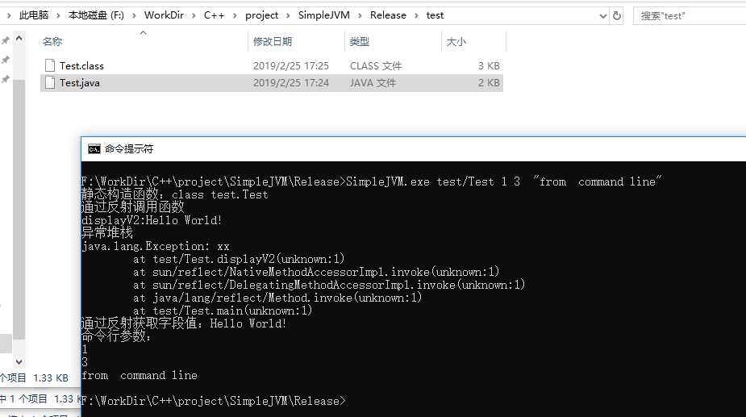

# 简易JVM

目前只是单线程， 未支持 ClassLoader，没有实现堆的内存管理功能。

```JAVA
public class Test {
    private int i;
    private long l;
    private double d;
    private String s;

    static {
        System.out.print("静态构造函数：");
        System.out.println(Test.class.toString());
    }

    public Test()  {
    }

    public Test(String x) {
        s = x;
    }

    public void v2(int v) {
        this.i = v;
    }

    public void displayV2() {
        System.out.println("displayV2:" + s);

        System.out.println("异常堆栈");
        Exception e = new Exception("xx");
        e.printStackTrace(System.out);
    }

    public static void main(String[] args) throws Exception {
        Constructor<Test> constructor = Test.class.getDeclaredConstructor(String.class);
        Test t = constructor.newInstance("Hello World!");

        System.out.println("通过反射调用函数");
        Method method = Test.class.getDeclaredMethod("displayV2");
        method.invoke(t);

        System.out.print("通过反射获取字段值：");
        Field s1 = Test.class.getDeclaredField("s");
        System.out.println(s1.get(t));

        System.out.println("命令行参数：");
        for (String arg:args) {
            System.out.println(arg);
        }
    }
}
```

